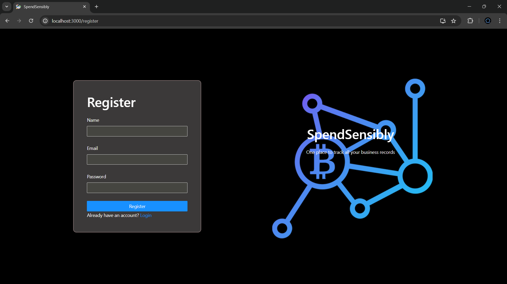
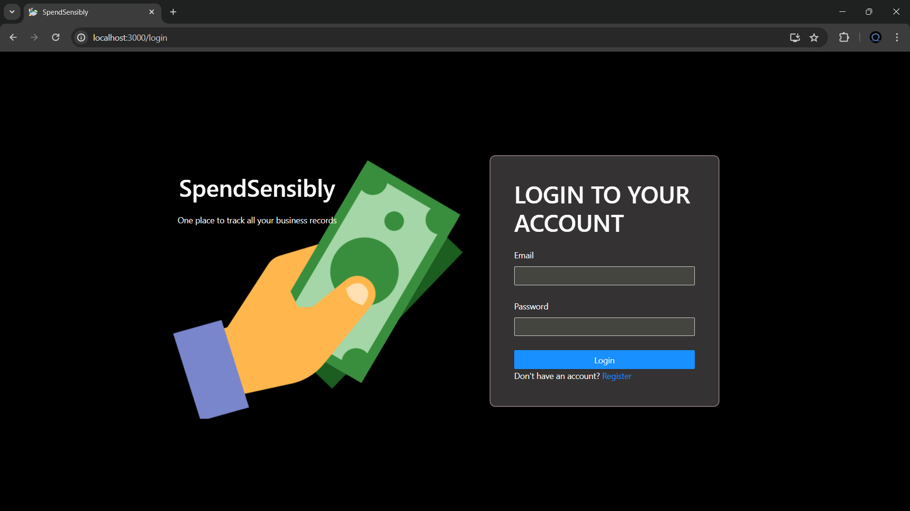
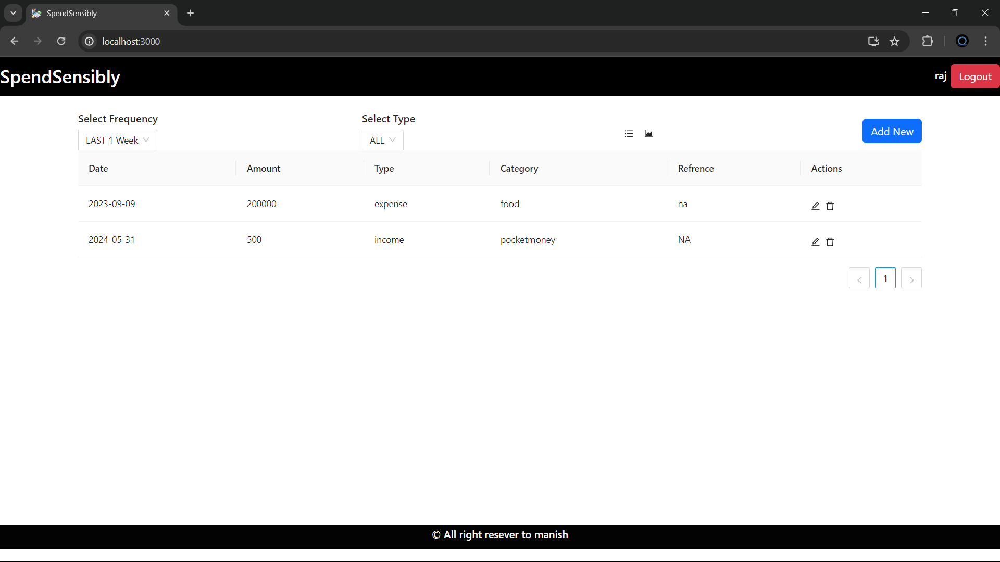
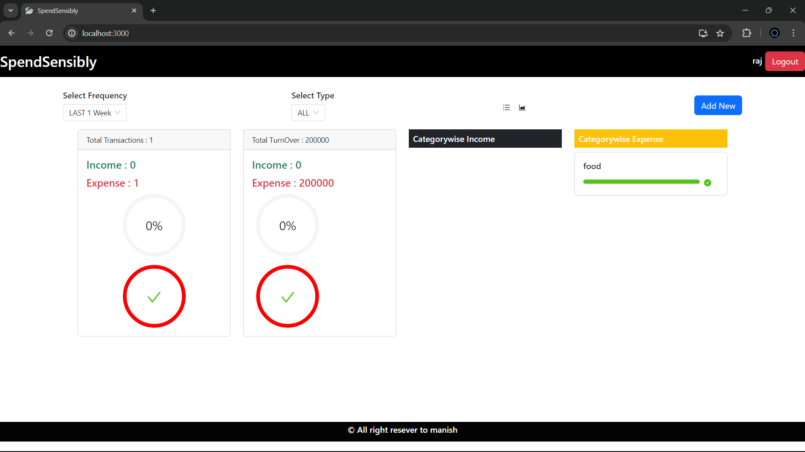
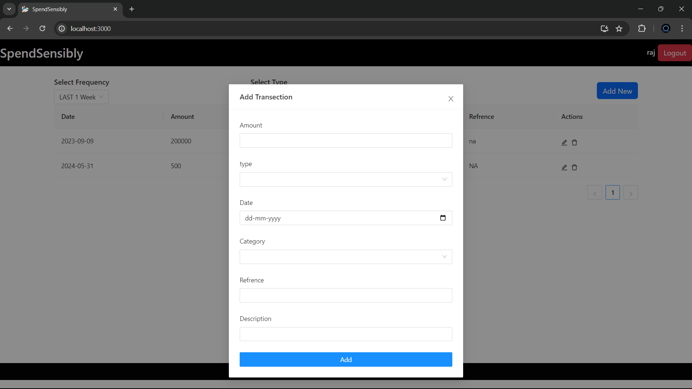

# Spend Sensibly

Spend Sensibly is an expense tracking and budgeting application designed to help users manage their finances effectively. With Spend Sensibly, users can track their expenses, set budgets, and gain insights into their spending habits through reports and analytics.

## Features

### Expense Tracking

- Log expenditures with details such as amount, date, category, and notes/tags.
- View and edit expense records.
- Delete expenses when necessary.

### Budgeting

- Set spending limits for different expense categories.
- Allocate portions of monthly income to expense categories.
- Receive visualizations and notifications to stay within budgeted amounts.

### Statistics

- Generate Statistics of spending by category.
- Analyze spending trends over time.
- Compare actual spending to budgeted amounts.

## Setup Instructions

To set up Spend Sensibly on your local machine, follow these steps:

1. Clone the repository to your local machine:

git clone https://github.com/prosedus007/spendsensibly.git

css
Copy code

2. Navigate to the project directory:

cd spendsensibly

markdown
Copy code

3. Install dependencies for both the frontend and backend:

cd client  
npm install  

npm install

markdown
Copy code

4. Set up the database:

   - Spend Sensibly uses MongoDB as its database. Make sure you have MongoDB installed and running on your machine.
   - Create a `.env` file in the `server` directory and add your MongoDB connection string:

MONGODB_URI=your-mongodb-connection-string

markdown
Copy code

5. Start the backend server:

npm start

markdown
Copy code

6. Start the frontend development server:

cd client  
npm start

less
Copy code

7. Open your web browser and navigate to `http://localhost:3000` to use Spend Sensibly.

## Technologies Used

- MongoDB
- Express.js
- React.js
- Node.js

## Screenshots

